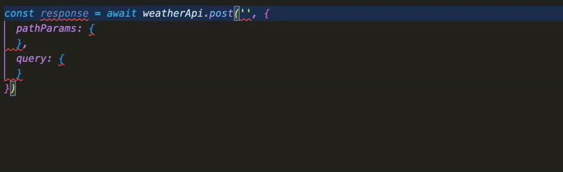

# Indulgent

A simple type-safe, dependency-free API toolkit for TypeScript.

See the github.io page for documentation: https://frodi-karlsson.github.io/indulgent/ and the examples directory for example projects.

The main reason to want to use this is rich autocomplete for API calls. See example below:

I aim to use this only for my own personal projects, but if you think it looks useful, go ahead and use it / contribute / complain :)
