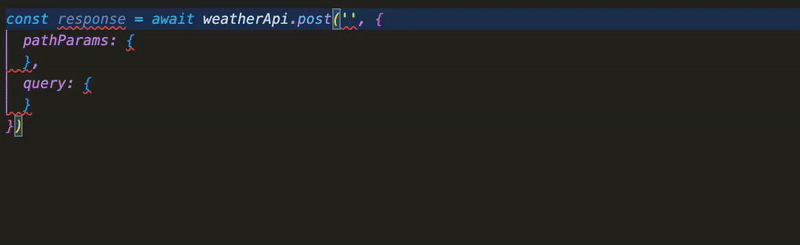

# Indulgent

A simple type-safe, dependency-free API toolkit for TypeScript.

See the github.io page for documentation: https://frodi-karlsson.github.io/indulgent/ and the examples directory for example projects.

The main reason to want to use this is rich autocomplete for API calls. See example below:



I aim to use this only for my own personal projects, but if you think it looks useful, go ahead and use it / contribute / complain :)

## Installation

```bash
npm install indulgent
# or
yarn add indulgent
# or
pnpm add indulgent
```

## Usage

See [examples](/examples) and [docs](https://frodi-karlsson.github.io/indulgent/)

```ts
import { ApiService } from 'indulgent/api';

type Endpoint = {
  method: 'GET';
  path: '/posts/:id';
  query: {
    includeComments?: boolean;
  };
  response: {
    id: number;
    title: string;
    content: string;
    comments?: { id: number; content: string }[];
  };
};

class PostApi extends ApiService<Endpoint> {}
const api = new PostApi();

await api.get('/posts/1', {
  query: { includeComments: true },
  pathParams: { id: 1 },
});
```
